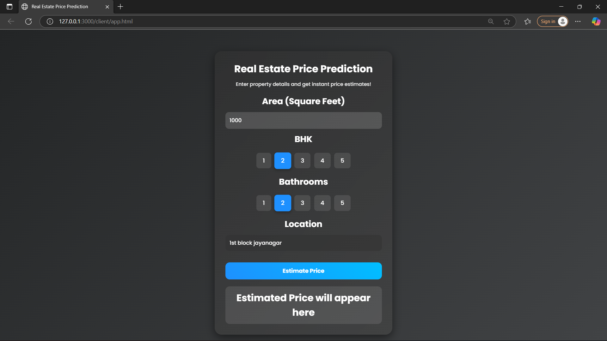

# Real Estate Price Prediction

This is a Machine Learning + Flask Web App that predicts the price of real estate properties based on features like location, square feet area, BHK, and number of bathrooms.  
It comes with a beautiful UI having gradient + glassmorphism design ✨.

---

## 📌 Features

- Predict house prices using ML model  
- User-friendly Flask API backend  
- Modern Frontend with gradient & glassmorphism  
- Dropdown for location selection  
- Responsive design (works on laptop & desktop)  
- Can be deployed easily on Heroku / Railway / Render  

---

## ⚙️ Tech Stack

- **Frontend:** HTML, CSS, JavaScript  
- **Backend:** Python, Flask, Flask-CORS  
- **ML Libraries:** scikit-learn, pandas, numpy, joblib  
- **Deployment:** Gunicorn (for production servers)  

---

## 🚀 Installation & Setup

### 1. Clone this repository
```bash
git clone https://github.com/your-username/real-estate-price-prediction.git
cd real-estate-price-prediction
```

### 2. Create Virtual Environment (recommended)
```bash
python -m venv venv
source venv/bin/activate   # for Linux/Mac
venv\Scripts\activate      # for Windows
```

### 3. Install Dependencies
```bash
pip install -r requirements.txt
```

### 4. Run the Flask server
```bash
python server.py
```

### 5. Open frontend
Simply open app.html in your browser (linked with app.css and app.js).

---

## 🔥 API Endpoints
✅ Get Location Names

GET /get_location_names

## Response:
```bash
{
  "locations": ["Banashankari", "Whitefield", "Electronic City", ...]
}
```

## ✅ Predict Home Price

POST /predict_home_price

## Form Data:
```bash
{
  "total_sqft": 1200,
  "location": "Whitefield",
  "bhk": 3,
  "bath": 2
}
```

## Response
```bash
{
  "estimated_price": 85.6
}
```

## 📸 Screenshots

### Price Prediction


## 🤝 Contributing

Pull requests are welcome. For major changes, please open an issue first to discuss what you would like to change.


### 📜 License

This project is licensed under the MIT License – you are free to use and modify it.
